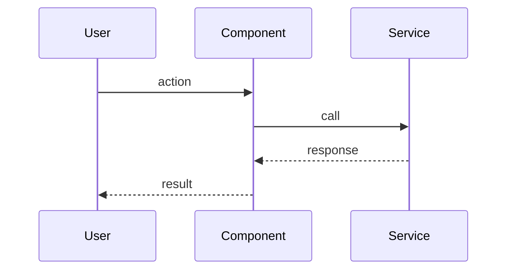

# Task: Explain Module

> Single-prompt task. Khác với `deep-dive-learn` (5-phase iterative), task này 1-shot quick understanding.

## Khi dùng

- Cần hiểu module trong 5-10 phút.
- Lần đầu touch module này.
- Trước khi làm task nào liên quan module này.

## Output template

```markdown
# Module: <name>

## TL;DR (1 paragraph)

<3-5 sentences: what it does, why it exists, key abstractions>

## Files

| File | Purpose | LOC |
|---|---|---|
| <path> | <1 sentence> | <count> |
| ... | ... | ... |

## Public API

```<language>
// signatures of exported functions/classes
```

## Sequence diagram (1 critical flow)



## Dependencies

- External: <list libs/services>
- Internal: <list modules imports from>

## Patterns used

- <Pattern name> — at <file:line>
- ...

## Edge cases handled

- <case 1> — at <file:line>
- ...

## Edge cases NOT handled (potential bugs)

- <case 1> — would fail at <file:line>
- ...

## Where to extend

- Add new <thing> by: <file>, follow pattern at <file:line>

---
**Confidence**: <low/med/high>
**Files read fully**: <count> / <total>
**Sampled (not full read)**: <list>
**Decision points**: D-1: ...
```

## Halt conditions

- Module > 30 file → chia thành sub-modules trước (list sub-folders, chọn 1 sub-module < 30 file để bắt đầu); hoặc suggest `deep-dive-learn` nếu user cần full lifecycle doc.
- Module mostly generated code → ask user clarify what to focus on.

## Prompt template

```
@workspace explain module: <PATH>

Adopt persona Mary 📊 (Analyst).

Task: .prompts/tasks/explain-module.md

Output đầy đủ trong 1 response (template trong file task).

Cite file:line cho mọi claim.
```
