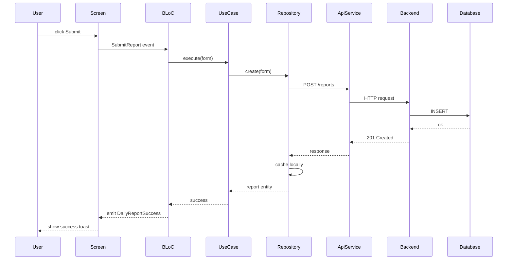

# Task: Trace Flow

> Single-prompt. Theo dấu 1 user action xuyên suốt các tầng kiến trúc. Useful cho debug + onboard.

## Khi dùng

- Bug "tôi click X mà không thấy gì xảy ra" → trace để biết action chết ở tầng nào.
- Onboard developer mới → cho họ thấy 1 action go through đâu.
- Verify integration end-to-end.

## Output template

```markdown
# Flow trace: <action>

## Action

<user does what — vd: "user clicks Submit on Daily Report form">

## Steps (cite file:line per step)

### 1. UI layer

- File: `lib/presentation/screens/daily_report_screen.dart:123`
- Trigger: `onPressed` of `ElevatedButton`
- Calls: `context.read<DailyReportBloc>().add(SubmitReport(form))`

### 2. BLoC layer

- File: `lib/presentation/blocs/daily_report_bloc.dart:45`
- Handler: `_onSubmitReport`
- Validates: form non-empty
- Calls: `_submitReportUseCase.execute(form)`
- Emits: `DailyReportLoading` → `DailyReportSuccess | DailyReportError`

### 3. Use case layer

- File: `lib/domain/usecases/submit_report.dart:12`
- Logic: business validation (date not future, photos count ≤ 10)
- Calls: `_dailyReportRepository.create(form)`

### 4. Repository layer

- File: `lib/data/repositories/daily_report_repository.dart:67`
- Logic: maps form → API DTO
- Calls: `_apiClient.post('/reports', dto)`
- Caches: writes to local SQLite on success

### 5. Service / API client

- File: `lib/data/services/api_client.dart:33`
- HTTP: `POST /api/v1/reports`
- Headers: `Authorization: Bearer <token>`
- Body: `<DTO JSON shape>`

### 6. Backend (if visible)

- Endpoint: `<path>`
- Handler: `<controller method>`
- DB: `INSERT INTO reports (...)`

## Sequence diagram



## Failure points

| Step | What can fail | Detection | Recovery |
|---|---|---|---|
| 2 | Validation fail | BLoC emits Error | UI shows inline error |
| 3 | Business rule violation | UC throws | UC catches → returns Result<Error> |
| 4 | Mapping fail (DTO mismatch) | Throws JSON error | Log + re-throw |
| 5 | Network timeout | Throws TimeoutException | Repo retries 3x then fail |
| 5 | 4xx/5xx | Throws ApiException | Repo handles 401 → refresh token |
| 6 | DB constraint | API 422 | UI shows server-side error |

## Performance characteristics

- Estimated latency: <ms> (UI → success)
- Bottleneck: <step>
- Optimization opportunity: <list>

---
**Confidence**: <low/med/high>
**Files cited**: <count>
**Steps not visible (out of repo)**: <list>
```

## Halt conditions

- Action không tìm được entry point → ask user clarify "click button nào, screen nào".
- Flow vượt repo (BE in another repo) → annotate boundary, stop trace.

## Prompt template

```
@workspace trace flow: <ACTION>

Adopt Mary 📊 (Analyst).

Task: .prompts/tasks/trace-flow.md

Action: <ACTION>
Entry point hint (optional): <screen/button/handler>

Output: full trace với cite file:line per step + Mermaid + failure points table.
```
