# Domain: <NAME>

> Last updated: <YYYY-MM-DD>

---

## Bounded context

<TODO — 2-3 câu mô tả ranh giới, scope.>

## Ubiquitous language

| Term | Definition |
|---|---|
| <TODO> | <TODO> |

## Entities

| Entity | Identity | Path |
|---|---|---|
| <TODO — vd "User"> | <vd "userId"> | <vd "lib/domain/entities/user.dart"> |

## Value objects

| Name | Properties |
|---|---|
| <TODO — vd "Email"> | <vd "value: String, validates RFC 5322"> |

## Aggregates

| Aggregate | Root | Children |
|---|---|---|
| <TODO> | <TODO> | <TODO> |

## Domain events

| Event | Triggered when | Subscribers |
|---|---|---|
| <TODO — vd "UserRegistered"> | <vd "Sau khi user verified email"> | <vd "WelcomeEmailService, AnalyticsService"> |

## Domain services

> Logic không thuộc entity nào.

| Service | Path | Purpose |
|---|---|---|
| <TODO> | <TODO> | <TODO> |

## Invariants

> Rule luôn đúng. Vi phạm = bug.

<TODO — vd:
- Email must be unique per organization.
- User cannot belong to > 5 organizations.
- Deleted users cannot login (soft delete preserved 90 days).>

## State transitions (if applicable)

```mermaid
stateDiagram-v2
    [*] --> <TODO>
    <TODO> --> <TODO>: <event>
```

<TODO — vẽ state machine cho domain nếu có>

## Related

- Code: <TODO — vd `lib/domain/entities/user/`>
- Feature docs: <TODO>
- Integration: <TODO — vd "../integrations/firebase-auth.md">
