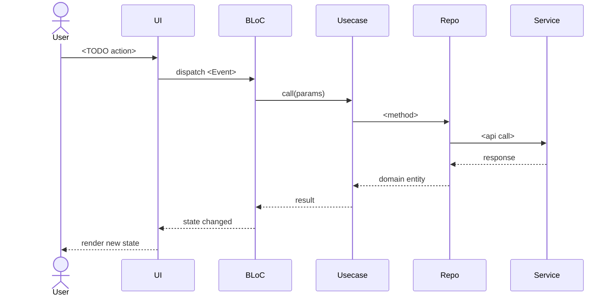
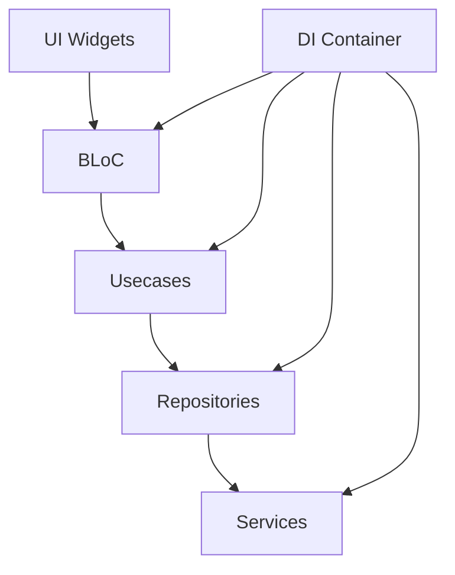

# System Patterns

> Architecture, design patterns, component relationships.
> CẬP NHẬT: khi có quyết định kiến trúc mới (link đến ADR).

---

## Architecture overview

<TODO — 1 đoạn mô tả high-level architecture.

Vd: "Layered architecture với 5 tầng (UI / BLoC / Usecase / Repository / Service).
Inversion: tầng cao gọi tầng thấp, tầng thấp KHÔNG gọi ngược.
DI bằng get_it. Routing bằng go_router. State bằng flutter_bloc.">

## Layers (or modules)

> Liệt kê các tầng/module và trách nhiệm.

| Layer | Path | Trách nhiệm | Cấm |
|---|---|---|---|
| <TODO — vd UI> | `<path>` | <vd: render widget, dispatch events> | <vd: gọi API trực tiếp> |
| <TODO> | `<path>` | <TODO> | <TODO> |
| <TODO> | `<path>` | <TODO> | <TODO> |

## Data flow (key example)

> 1 sequence diagram cho luồng tiêu biểu.

<TODO — sửa diagram cho project của bạn>

## Design patterns đang dùng

> Liệt kê pattern + lý do + reference.

| Pattern | Áp dụng ở đâu | Why | Reference |
|---|---|---|---|
| <TODO — vd Repository> | <TODO — vd `lib/data/repositories/`> | <TODO — vd "Tách data access khỏi business logic"> | <TODO — vd `examples/repository-pattern.md`> |
| <TODO> | <TODO> | <TODO> | <TODO> |

## Component relationships

> Quan hệ giữa các module/component chính.

<TODO — vd Mermaid graph:

>

## Critical implementation paths

> Đường code QUAN TRỌNG, AI cần đặc biệt cẩn thận khi sửa.

<TODO — vd:
- **Auth flow**: `lib/core/auth/` — sai sẽ dẫn đến security hole. Test phải pass 100%.
- **Sync engine**: `lib/data/sync/` — race condition tiềm ẩn nếu sửa không cẩn thận.>

## Active ADRs

> Link đến ADR đang Active. Phải tuân thủ.

<TODO — vd:
- [ADR-0001](../docs/adr/0001-state-management.md) — flutter_bloc as state management.
- [ADR-0002](../docs/adr/0002-routing.md) — go_router for routing.>

---

**Confidence**: <TODO>
**Last updated**: <YYYY-MM-DD>
