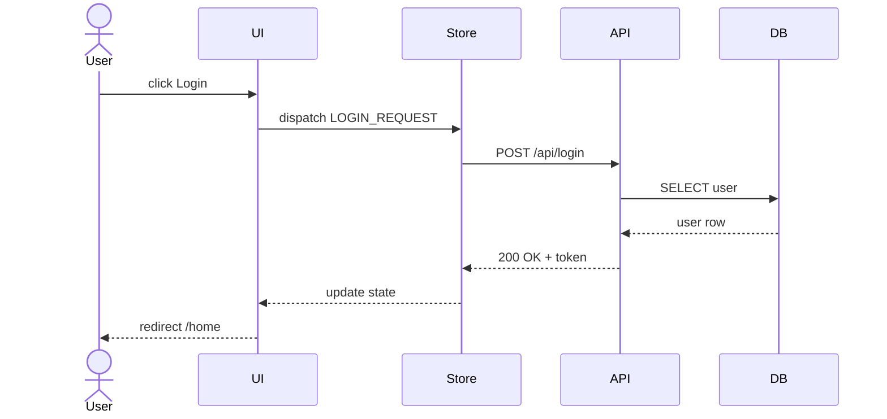

# Sample: Trace Flow

## Khi nào dùng

- Muốn hiểu "user nhấn nút X thì backend làm gì".
- Trace bug khó để biết flow đi qua đâu.
- Tạo doc cho luồng quan trọng (login, checkout, payment).

## Reference

- Task: [.prompts/tasks/trace-flow.md](../.prompts/tasks/trace-flow.md)
- Snippet: [.prompts/snippets/force-cite.md](../.prompts/snippets/force-cite.md), [.prompts/snippets/self-verify.md](../.prompts/snippets/self-verify.md)

## Prompt

```
follow your custom instructions

Task: trace flow.

Flow cần trace: <ví dụ: "user nhấn Login button → nhận response 200 OK">

Output file: <output: path/to/file.md>

Yêu cầu output theo cấu trúc:

# Flow: <tên flow>

## Trigger
- Entry point: <component / handler / endpoint>. Cite file:line.
- Input: <data structure>.

## Steps
| # | Layer | File:line | Hành động |
|---|---|---|---|
| 1 | UI | src/components/LoginForm.tsx:42 | onSubmit gọi loginAction |
| 2 | State | src/store/auth.ts:18 | dispatch LOGIN_REQUEST |
| 3 | API | src/api/auth.ts:7 | POST /api/login |
| ... | ... | ... | ... |

## Sequence diagram (Mermaid)



## Data transformations
- Input → step 2: <mô tả>.
- Step 3 → step 4: <mô tả>.
- ...

## Failure points / Bottlenecks
- <điểm có thể fail + cite file:line + impact>.
- <bottleneck performance + cite>.

## Side effects
- DB write?
- External API call?
- Cache invalidation?
- Event published?

## Tests covering this flow
- <test file:line>.
- Coverage gap nếu có.

---
**Confidence**: <low|medium|high>
**Assumptions**:
- A-1: ...
**Self-verify**: <N>/9 nhóm pass theo `.prompts/snippets/self-verify.md`.

Constraints:
- Mỗi step phải cite file:line. Không cite được → ghi "không thấy trong codebase loaded" + suy luận có nhãn.
- Áp dụng `.prompts/snippets/force-cite.md`.
- Self-verify trước khi xuất.

Mode: analysis-only. Không sửa code app.
Scope: edit allowed = [<output file>].

Risk preflight:
- Flow đi qua nhiều module → ưu tiên path chính, ghi nhánh phụ vào "Variants".
- Code chưa load đủ → ghi rõ chỗ chưa thấy.
```

## Variants

- **Bug-trace mode**: thêm section "Hypothesis bug location" cuối file.
- **Performance-trace mode**: thêm cột "Time complexity / I/O cost" trong bảng Steps.
- **Security-trace mode**: thêm section "Auth / authz check at each step".

## Verification

- Mở file output, chọn 5 cite file:line ngẫu nhiên, verify trong codebase.
- Render Mermaid (VSCode preview hoặc mermaid.live) → diagram đúng cú pháp.
